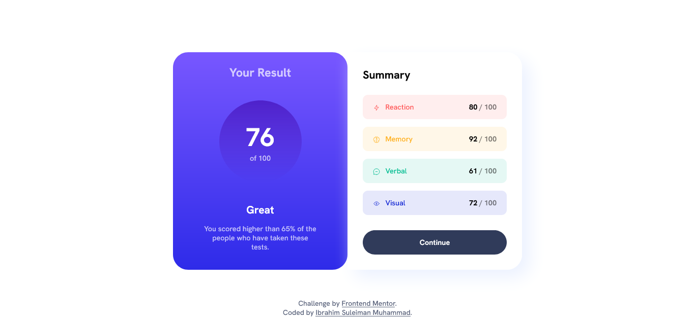
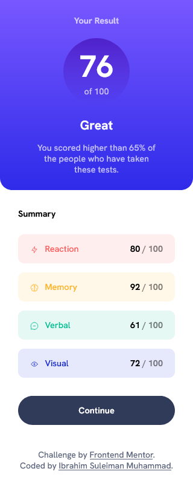

# Frontend Mentor - Results summary component solution

This is a solution to the [Results summary component challenge on Frontend Mentor](https://www.frontendmentor.io/challenges/results-summary-component-CE_K6s0maV). Frontend Mentor challenges help you improve your coding skills by building realistic projects.

## Table of contents

- [Overview](#overview)
  - [The challenge](#the-challenge)
  - [Screenshot](#screenshot)
  - [Links](#links)
- [My process](#my-process)
  - [Built with](#built-with)
  - [What I learned](#what-i-learned)
  - [Continued development](#continued-development)
  - [Useful resources](#useful-resources)
- [Author](#author)
- [Acknowledgments](#acknowledgments)

## Overview

### The challenge

Users should be able to:

- View the optimal layout for the interface depending on their device's screen size
- See hover states for all interactive elements on the page

- **Note**: Although there is a JSON file included, I did not use it to populate the data dynamically as I still haven't learned JavaScript as at the time of deploying this (3:33 PM; 7th Oct, 2023)

### Screenshot

A screenshot of the site to give you a quick view of the site on both the desktop and mobile view.
Add a screenshot of your solution. The easiest way to do this is to use Firefox to view your project, right-click the page and select "Take a Screenshot". You can choose either a full-height screenshot or a cropped one based on how long the page is. If it's very long, it might be best to crop it.

### Links

- Solution URL: [Add solution URL here](https://your-solution-url.com)
- Live Site URL: [Add live site URL here](https://your-live-site-url.com)

## My process

### Built with

- Semantic HTML5 markup
- CSS custom properties
- Flexbox
- CSS Grid
- Mobile-first workflow

### What I learned

This is my first attempt at both mobile-first and responsive design. It is honestly easier than I thought it would be. I'm sure I'm saying this only because I haven't been into it for a long time, but still, it was pretty easy. It took two days to complete though lol.

### Continued development

I would love to dive deeper into flex and grid layouts. I believe they're very powerful tools that would aid in my becoming a better web developer.

### Useful resources

For this project, like usual, I googled a ton of things, even basic things that I honestly should've know by heart at this point. I also used the free version of OpenAI's ChatGPT and Google Bard.

Can't forget the MDN Web Docs now can I. Best guide I've received so far in my journey.

## Author

- Website - [Ibrahim Suleiman Muhammad]("https://ebeesule.carrd.co/")
- Frontend Mentor - [@ebeeraheem](https://www.frontendmentor.io/profile/ebeeraheem)
- Instagram - [@ebee_sule] (https://www.instagram.com/ebee_sule)
- Twitter - [@ebeesule](https://www.twitter.com/ebeesule)

## Acknowledgments

I would like to acknowledge myself for being resilient and not giving up.
